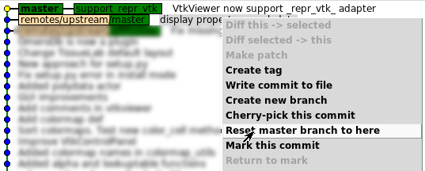

.. _git-usual-errors:

=====================
Usual errors with git
=====================

I did all my commits in my personal master ... oops
===================================================

It is very easy to create a new branch from master, dont worry!
First create right now a new branch

.. code-block::
    
    git checkout -b mybranch

Now all your development are in both master and mybranch. You can check it with gitk.

.. code-block::
    
    gitk --all

Then, reset master to its original state

.. code-block::
    
    git checkout master

In gitk, right click on text corresponding to upstream/master and select reset master branch to here.
In screenshot, "support_repr_vtk" correspond to mybranch.

Now, all is correct. Just push your new branch

.. code-block::
    
    git push --set-upstream origin mybranch

I cloned official repository but i now want to contribute
=========================================================

Generally, when you are just user, you clone official repository ...
But when you become developer, you need to create your personal one to follow git workflow.
Here a tip to change it without restarting from scratch:

.. code-block::

    git remote rename origin upstream
    git remote add origin git:...
    git fetch upstream
    git fetch origin
    git push --set-upstream origin mybranch

