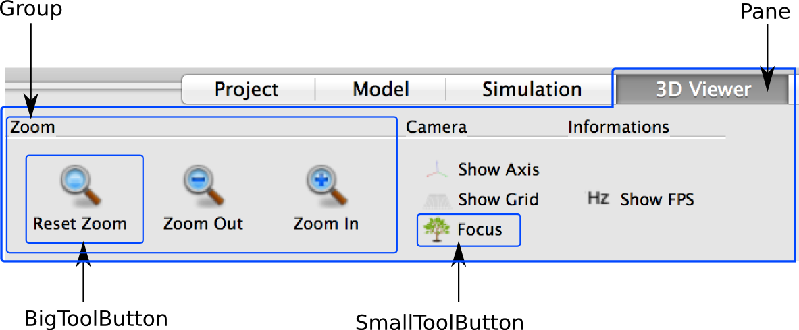

====================
Graphical Components
====================

.. testsetup::

    from openalea.vpltk.qt import QtGui
    instance = QtGui.QApplication.instance()
    if instance is None:
        app = QtGui.QApplication([])
    else:
        app = instance

    # .. testcleanup::
    # 
    # if instance is None:
    #    app.exec_()

Build new graphical application
===============================

OpenAleaLab proposes classes to create generic "labs".
A lab is a graphical interfaces providing several features :

  - **python shell**: runs scripts
  - **editors** : view and edit scripts, workflow, ...
  - **managers**: manage packages, plugins and projects
  - **viewer**: displays a scene in 2d or 3d
  - **scene**: a generic representation of all data used in simulation
  - **reporting**: show logs, history, ...

Library also provides generic object to ease GUI creation like ribbon bars,
mainwindow classes, but OpenAleaLab is not a generic application framework like Qt.

Builtin widget to ease Graphical Application development
========================================================

Group node widgets
------------------

.. code-block:: python
    :filename: lib.py
    
    def myfunc(a, b, c):
        print(a, b, c)

.. code-block:: python

    from openalea.core import Node, Factory, IBool, IInt, IStr
    from openalea.core.node import FuncNode
    from openalea.core.traitsui import View, Group, Item
    from openalea.visualea.node_widget import DefaultNodeWidget

    view = View(
        Group('Custom Control',
            Group('AB Group', Item('a'), Item('b'), layout="-"),
            Group('C Group', Item('c')),
            layout='|'),
        )

    inputs = [
        {'interface': IBool, 'name': 'a', 'value': False, 'desc': ''},
        {'interface': IInt, 'name': 'b', 'value': 0, 'desc': ''},
        {'interface': IStr, 'name': 'c', 'value': '', 'desc': ''}
        ]

    node_factory = Factory(name='myfunc',
                    authors=' (wralea authors)',
                    description='',
                    category='Unclassified',
                    nodemodule='lib',
                    nodeclass='myfunc',
                    inputs=inputs,
                    view=view,
                    )

    if __name__ == '__main__':
        from openalea.vpltk.qt import QtGui
        app = QtGui.QApplication([])
        node = node_factory.instantiate()
        w = DefaultNodeWidget(node, parent=None)
        w.show()
        app.exec_()

Create Paned menus (Ribbon bars)
--------------------------------

Paned menus, also called "ribbon bars" are alternatives to classical Tool bars.
It allows to emphasize some action with larger buttons.
To create a Paned menu, you just need to create a
:class:`~openalea.oalab.gui.menu.PanedMenu` and add :class:`~QtGui.QAction` with
:meth:`~openalea.oalab.gui.menu.PanedMenu.addBtnByAction` method.

PanedMenu components :

Main classes and methods
========================

.. autoclass:: openalea.oalab.gui.menu.PanedMenu
    :members: addBtnByAction

