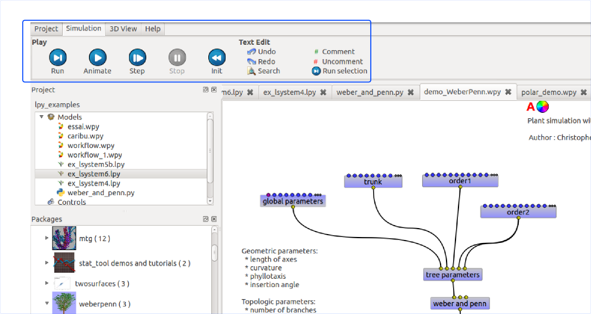

============================================
Build Graphical Application with OpenAleaLab
============================================

Paned menus
===========

Paned menus, also called "ribbon bars" are alternatives to classical Tool bars.
It allows to emphasize some action with larger buttons.

For example, in PlantLab :

To create a Paned menu, just create a PanedM

.. image:: images/api_ribbon_bar.png
    :width: 600px

.. autoclass:: openalea.oalab.gui.menu.PanedMenu
    :members:
    :undoc-members:

