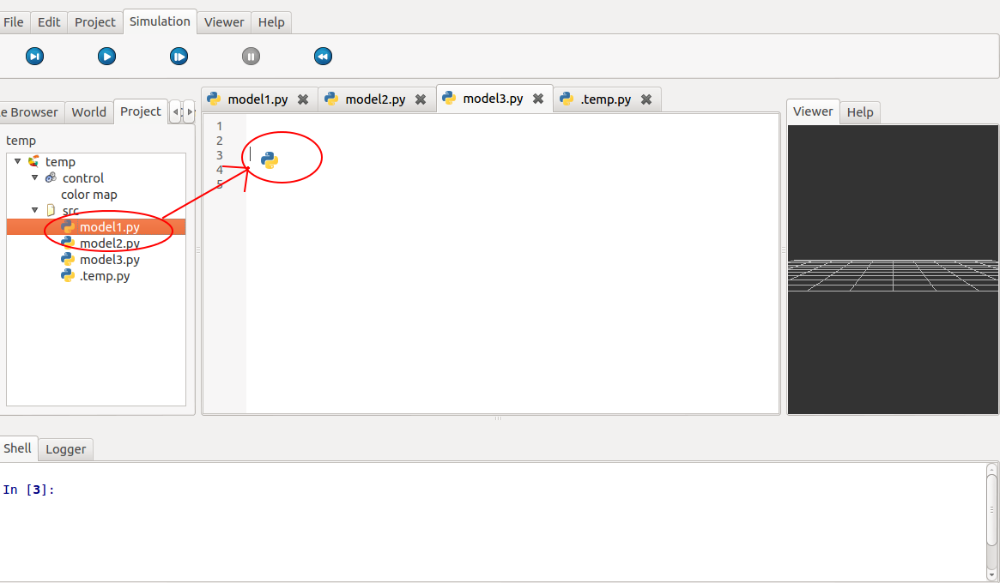
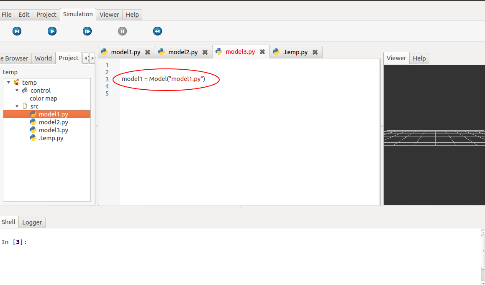

.. _label-model:

======
Models
======

Model Quick Start
=================

Here we suppose that we have a model named *sum_int* that do the sum between two integers. The classical use of this model is:

  - First, get the model:
      >>> sum_int = Model("sum_int")
  - Set inputs:
      >>> sum_int.inputs = 4, 38
  - Run model:
      >>> sum_int.run()
      >>> # Or simply:
      >>> sum_int()
  - Get result:
      >>> result, = sum_int.outputs
      >>> print "4 + 38 = ", result
      [out]: 4 + 38 =  42

You can get result in the run function:
      >>> result = sum_int.run()

Usage
=====

Instead of run, you can use other method like *step*, *init*, *animate*:

  - Run only one step of the model:
      >>> model.step()
  - Run the model step by step:
      >>> model.animate()
  - Set state of the model to initial one:
      >>> model.init()

You can set arguments directly inside the brackets. So each following block are equivalents and make a run on a model:

 - Classical:
      >>> model.inputs = 1, 2
      >>> model.run()
 - Shorter:
      >>> model.inputs = 1, 2
      >>> model()
 - Even shorter:
      >>> model.run(1, 2)
 - Shortest
      >>> model(1, 2)

Drag and Drop
=============

To access to a model, just drag object from panel "project" on the left in the GUI and drop it in an other model.

Models API
==========

.. automodule:: openalea.oalab.model.model
    :members:
    :undoc-members:

.. automodule:: openalea.oalab.model.python
    :members:
    :undoc-members:

