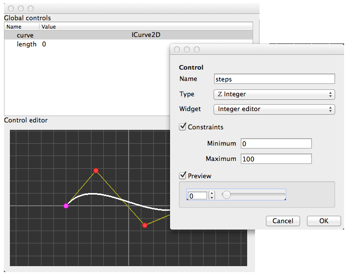

.. _label-plugin_control:

========
Controls
========

Overview
========

Introduction
------------

Idea behind control is to improve user interaction in application.
For that purpose, idea is to write a minimum amount of code to define only part specific to your needs
and let openalealab **generate automatically** complex widgets and user interaction like
  - Graphical view to draw virtual "laboratory equipment" (virtual oscilloscope for instance)
  - Table to summarize and edit all user input data (useful for user productivity)
  - Drag and drop between panels, view, models, ...
  - Compatibility with all frontends like OpenAleaLab, notebooks and command line
  - All future features you'll benefit without rewriting code

    Example of "summary table", "data editor" and "user data creator" generated automatically from "curve widget"

Technical details
-----------------

Technically, a :class:`~openalea.core.control.control.Control` is a data which:
    - provides an identifier, a name, an interface and a value
    - is observable, that means that when an attribute change, an event is sent.
    - is easily editable or viewable by graphical interfaces called "Control widgets"
    - may also define optional meta-informations like "suggested values" or "alias".

A control widget is a graphical element that allow user to edit, view or create  :class:`~openalea.core.control.control.Control`.

A Control widget selector is an object able to return the right widget depending on context.
Context depends on:

    - shape and place available: small, large, vertical
    - kind of use: editing, viewing, creating or painting

The widget part (control widget selector) loads and returns widget class.
The plugin part (control widget selector plugin) describes contexts supported by widget selector and provides preview.

These two steps (widget / plugin) are necessary because :

  - in one hand, users want to know all available widget to choose the best for their use.
  - in the other hand, widgets can be complex and heavy and cannot be loaded at startup

The "plugin part", by only describing widget, can answer to user expectations without loading real class.

Write your own widget
=====================

Control widget
--------------

If your widget fits well to all contexts, the easiest way is to use the widget class as both
"Control widget" and "Control widget selector".
 You just need to define the widget part as this widget will be used in all cases described in plugin.

.. testcode::

    from openalea.oalab.gui.control.widget import AbstractQtControlWidget
    class XyzControlWidget(AbstractQtControlWidget):
        def __init__(self):
            AbstractQtControlWidget.__init__(self)
            self.value_changed_signal = 'qt signal' # for example 'valueChanged()', 'currentTextChanged()', ...

        def reset(self, value=None, **kwargs):
            if value is None:
                self.setValue(REAL_VALUE)
            self.setC1(kwargs.get('constraint1', DEFAULT_CONSTRAINT1))

        def setValue(self, value):
            raise NotImplementedError

        def value(self):
            raise NotImplementedError

Plugin
------

To create a valid :class:`~ControlWidgetSelectorPlugin`, you must fill all these attributes :

    - controls: list of interface name supported. Ex: ['IInt', 'IFloat']
    - name: widget name (generally widget class name)
    - icon_path: path to an image (:term:`icon size`) representing this widget
    - preview_path: path to an image (:term:`preview size`) representing this widget
    - edit_shape: list of :term:`control shape` supported in :term:`edit mode`
    - view_shape: list of :term:`control shape` supported in :term:`view mode`
    - create_shape: list of :term:`control shape` supported in :term:`create mode`
    - paint: says if control widget is able to paint

Class is derivated from ControlWidgetSelectorPlugin that considers that attributes that are not
explicitly defined are empty (edit_shape, view_shape), null (icon_path='') or disabled (paint=False).

.. code-block:: python
    :filename: mypackage/plugins/__init__.py
    :linenos:

    import openalea.oalab

    from openalea.oalab.plugins.control import ControlWidgetSelectorPlugin
    from openalea.deploy.shared_data import shared_data

    class PluginXyzWidget(ControlWidgetSelectorPlugin):

        controls = ['IXyz'] # Interface name like IInt
        name = 'XyzWidgetSelector'
        required = []
        edit_shape = ['responsive']
        icon_path = shared_data(openalea.oalab, 'icons/Xyz_responsive.png')

        @classmethod
        def load(cls):
            from mypackage.plugins.widgets import XyzControlWidget
            return XyzControlWidget

register plugin
---------------

.. code-block:: python
    :filename: helper/setup.py
    :linenos:
    :emphasize-lines: 5,7

    setup(
        # setup instructions

        entry_points = {
            'oalab.qt_control':                                         # Plugin category
                [
                'PluginXyzWidget = mypackage.plugins:PluginXyzWidget'   # Plugin name = path to plugin (factory)
                ]
            }
        )

.. seealso::

    See IBool example for real case
    
Real life examples
==================

First example shows how to use QCheckBox to edit an IBool in all cases.
Second example, a bit more complex, shows how to use all Qt sliders (QSpinBox, QSlider and QDial) to edit an IInt.
This example also define a constraint widget to set min and max value for sliders.

Import used in both examples:

.. code-block:: python
    :linenos:

    from openalea.vpltk.qt import QtCore, QtGui
    from openalea.deploy.shared_data import shared_data

    import openalea.oalab
    from openalea.oalab.plugins.control import ControlWidgetSelectorPlugin
    from openalea.oalab.gui.control.widget import AbstractQtControlWidget

IBool control widget
--------------------

We define a widget based on QCheckBox like that:

.. image:: ../../../images/control_qcheckbox.png
    :align: center

This widget will be used for all shapes and will also be used as selector.

.. literalinclude:: ../../../openalea/oalab/src/openalea/oalab/plugins/controls/widgets.py
    :linenos:
    :pyobject: BoolCheckBox

Now, lets define plugin that links to it:

.. literalinclude:: ../../../openalea/oalab/src/openalea/oalab/plugins/controls/__init__.py
    :linenos:
    :pyobject: PluginIntWidgetSelector

Advanced documentation
======================

See :mod:`openalea.core.plugin.control`

