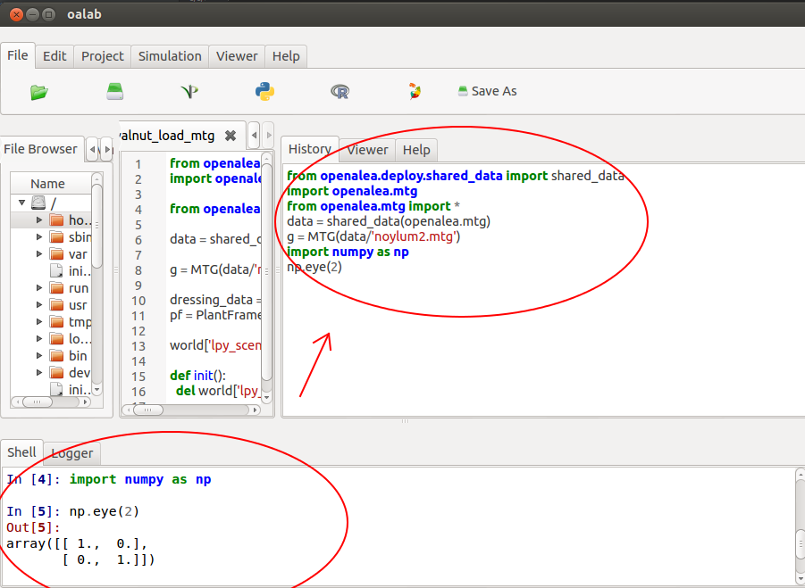
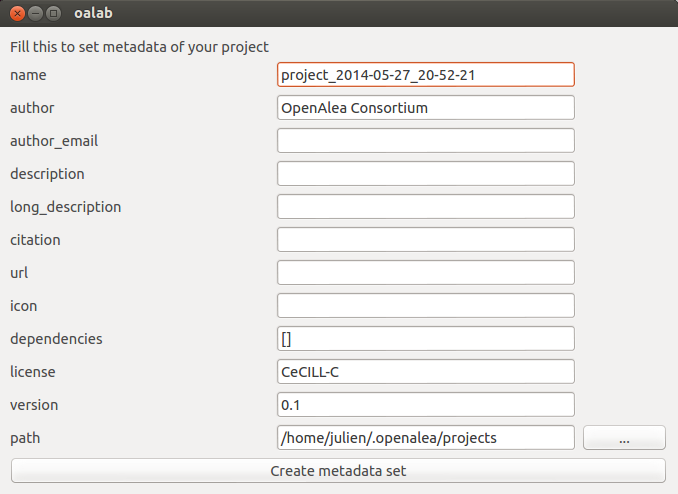
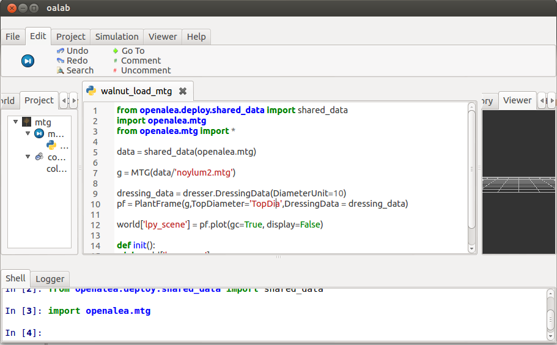
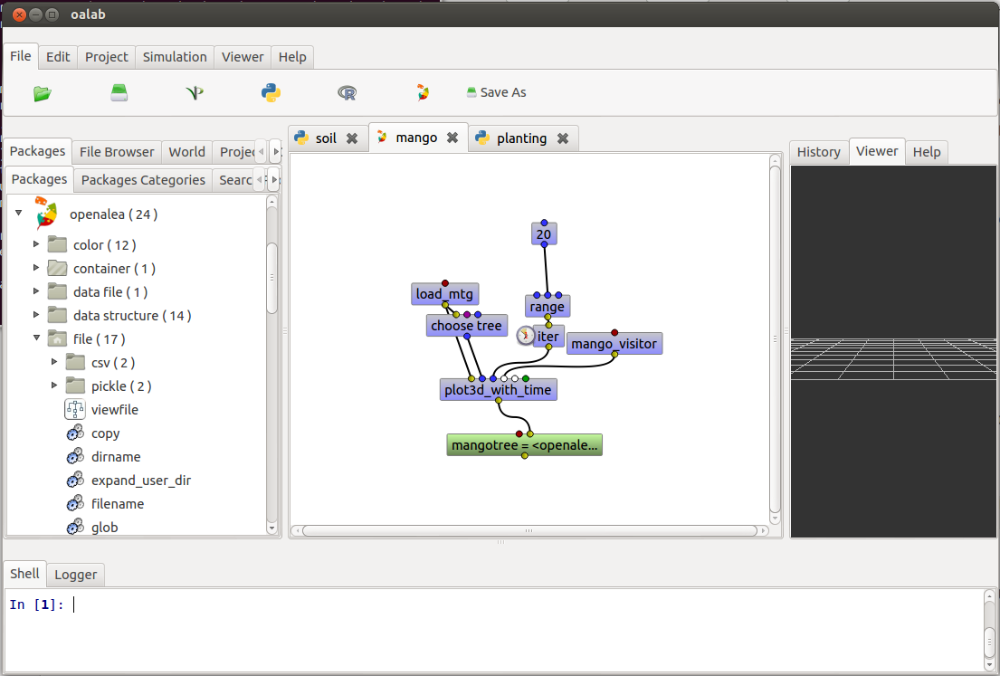
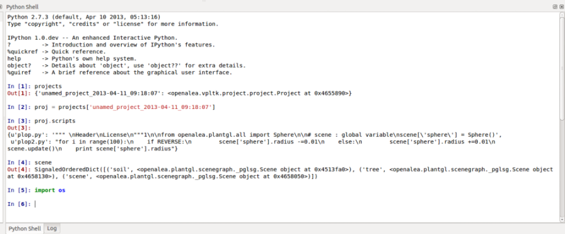
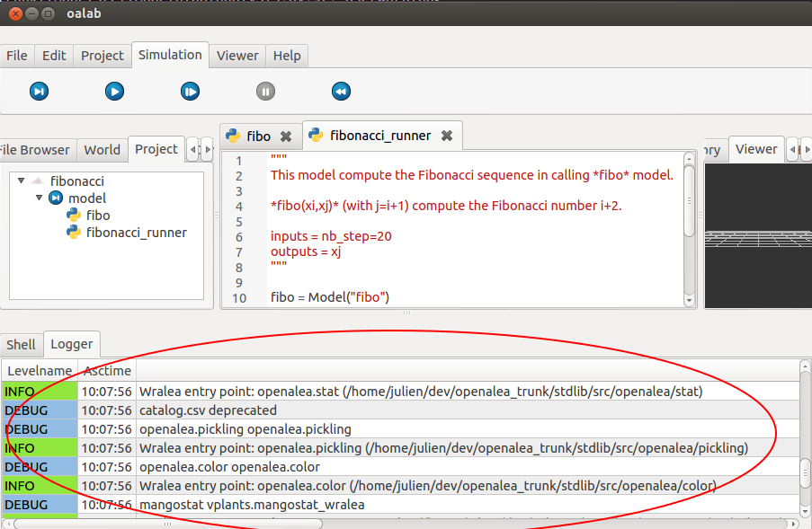

====================
User's Documentation
====================

Getting start
=============

Features
========

.. s'inspirer de https://support.rstudio.com/hc/en-us/categories/200035113-Documentation

Command History
---------------

OpenAleaLab automatically store all the commands that you use in the interpreter (bottom red circle) during the current session into the *history* panel (right red circle).

You can browse this history into the panel *History*.
The commands are displayed in order (most recent at the bottom).

This components is useful to check what you have done previously and how you have done it.
You can copy/paste a line that you have already used from the history into the interpreter.

Help
----

This graphical component display informations about objects that you can select.

It can display help from models, packages and nodes.

Using Project
-------------

Project Creation
################

Metadata
########

Project Loading
###############

Project Viewer
##############

Text Editor
-----------

  - Syntax Coloring
  - Tab Completion (Work in progress)
  - search (Ctrl+F)
  - go to (Ctrl+G)
  - execute selected code (Ctrl+R)
  - run model
      - run (F1)
      - step (F2)
      - animate (F3)
      - stop (F4) (Work in progress)
      - init (F5)

Workflow Editor
---------------

  - package manager
  - create node from PM
  - create node from models
  - create node from control

IPython Interpreter
-------------------

  - Syntax Coloring
  - Tab Completion (Work in progress)
  - magic commands
  - plots
  - interactive documentation

Store
-----

Work in progress

.. install package, plugin, labs

Control Panel
-------------

Work in progress

Logger
------

Permit to show many informations about Application execution (useful to debug but unusable for beginner).

File Browser
------------

A simple file browser which allow to check what is on your computer and to show and edit files.

World Viewer
------------

3D Viewer
---------
