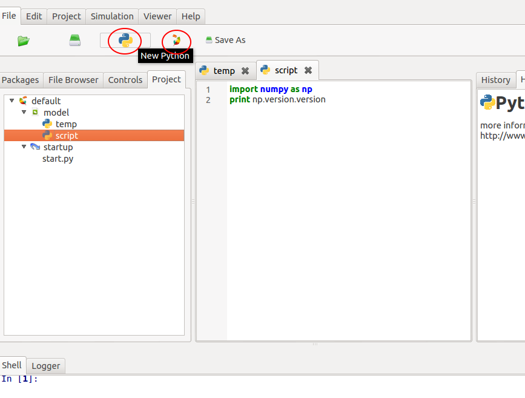
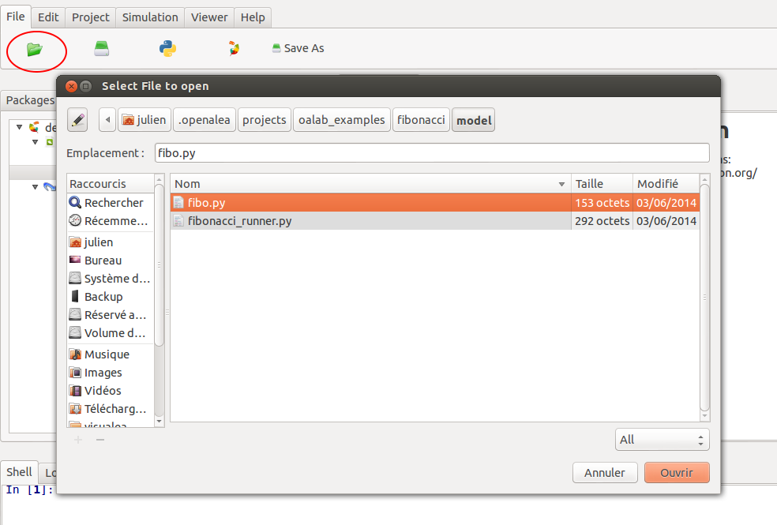
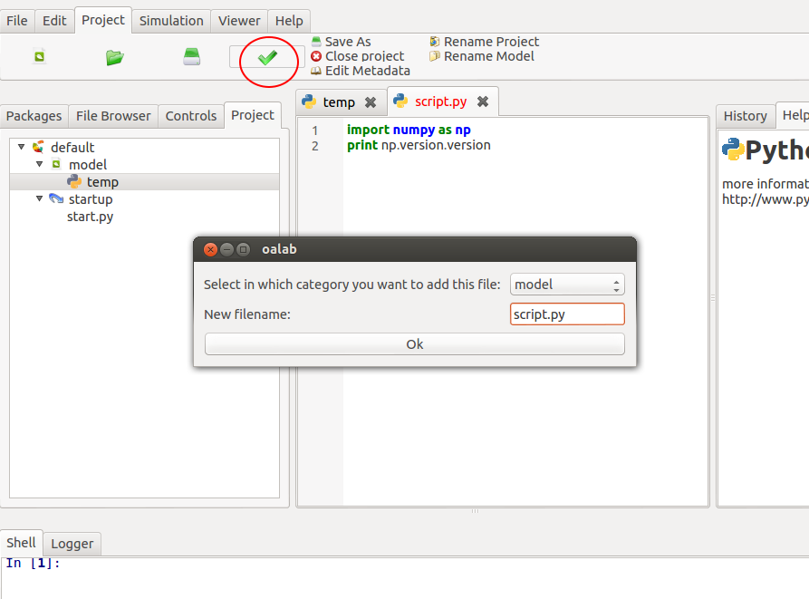
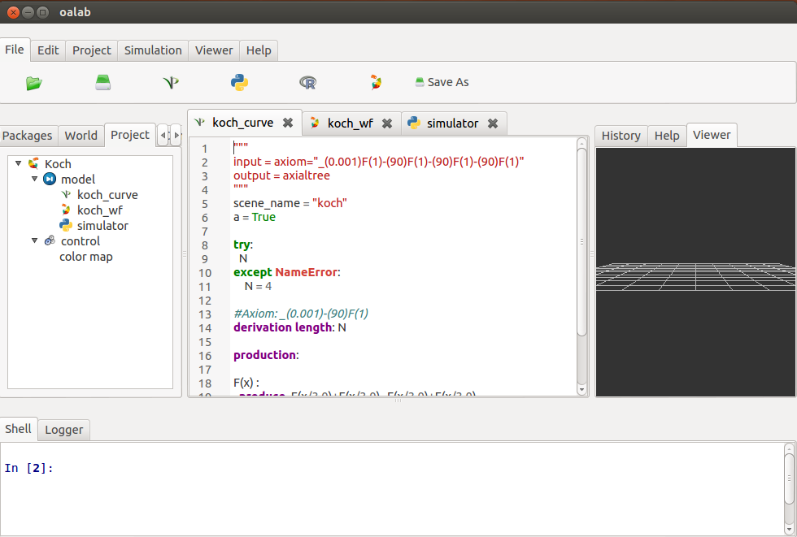
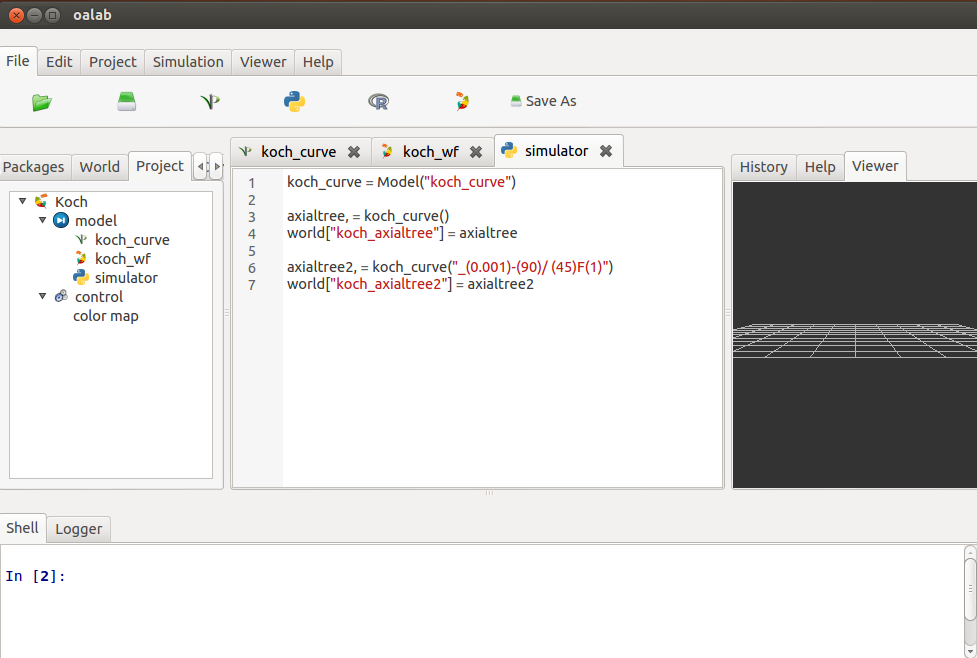
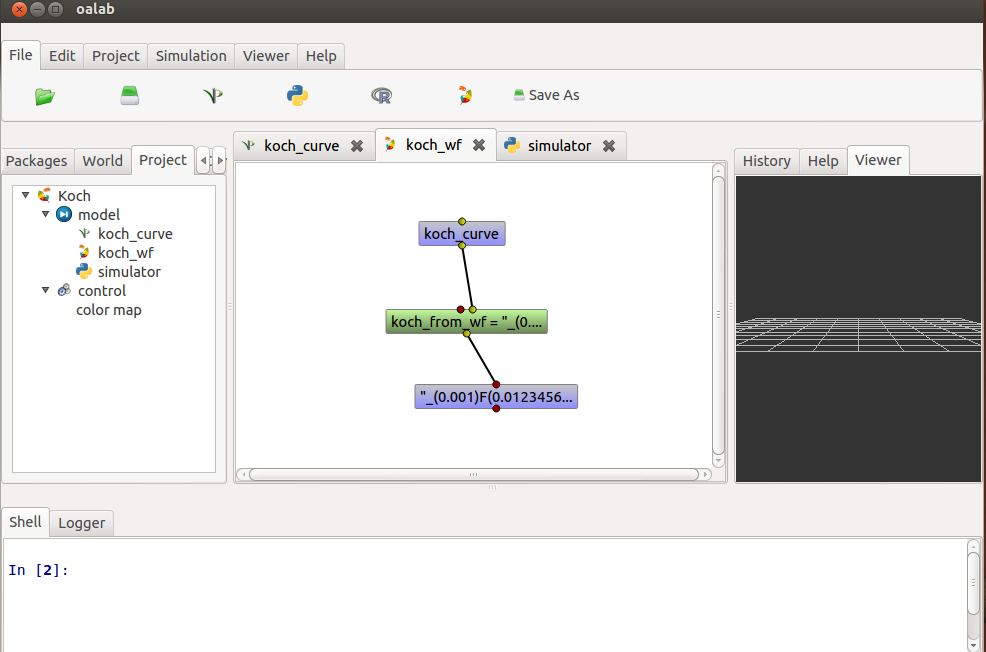

.. _label-user_model:

======
Models
======

Create New Model
================

To create a model, you can:

  - create new one from scratch
  - open an existing file

Create a new model:

Open an existing model:

Now you can edit it, run it, ...

Add Model to the current project
================================

Once you have your model, you must incorporate it inside your working project.
So, it will be accessible to the other models of your project.

Drag and Drop
=============

To access to a model, just drag object from panel "project" on the left in the GUI and drop it in an other model.

.. image:: ../../images/drag2.png
    :height: 400px
    :align:   center

.. image:: ../../images/drag3.png
    :height: 400px
    :align:   center

Using models inside other models
================================

Each model, whatever his *type* can be called inside whatever other model.

For instance, We define here an *L-system model* inside our project:

Then we can call this model from a *python model*. For this, we realize a simple drag and drop from the project viewer (at left) to our current model.

We can use it inside a *workflow model* too:

.. seealso::

    Developer's documentation :ref:`label-api_model`.
